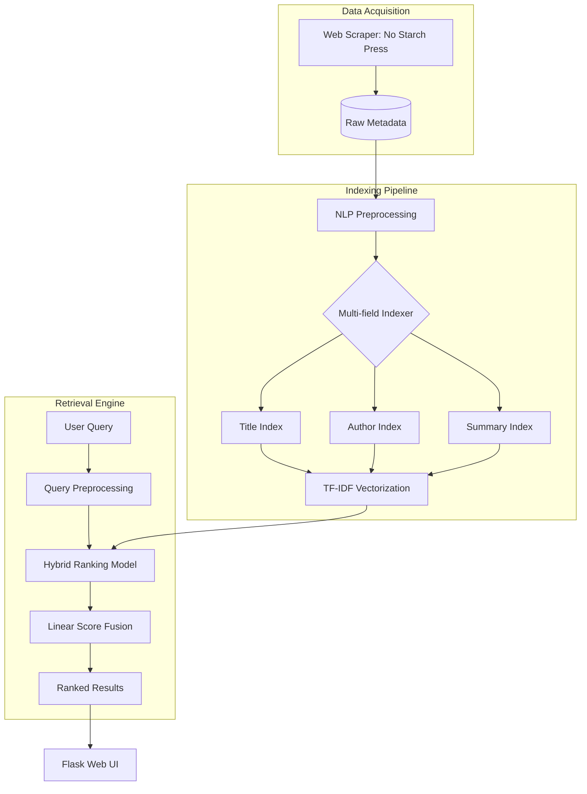

# SCUPI 2026 IR Project --Group 4


[](https://www.google.com/search?q=https://www.python.org/downloads/)
[](https://www.google.com/search?q=https://flask.palletsprojects.com/)
[](https://www.google.com/search?q=https://www.nltk.org/)
[](https://www.google.com/search?q=)

## Overview

HybridSearch is an advanced Information Retrieval (IR) system that evolves beyond simple keyword matching. It implements a Multi-field Hybrid Retrieval architecture, combining lexical precision with semantic context. By utilizing a linear fusion model, the engine weighs different document fields (Title, Author, Summary) and balances statistical relevance with semantic similarity to deliver highly accurate search results.

-----

##  System Architecture

The system utilizes a decoupled pipeline architecture, separating the heavy indexing workload from the real-time retrieval logic.



-----

##  Key Technical Features

### 1\. Multi-Field Representation

Unlike basic engines that flatten data, this system treats documents as multi-dimensional entities. It indexes **Title**, **Author**, and **Summary** separately, allowing for field-specific importance weighting during the retrieval phase.

### 2\. Advanced NLP Pipeline

  * **Tokenization & Normalization:** Standardizing raw HTML text.
  * **Stopword Elimination:** Filtering non-informative tokens using NLTK corpora.
  * **Porter Stemming:** Reducing morphological variants to their root form (e.g., "programming" → "program").

### 3\. Hybrid Ranking & Linear Fusion (Core Innovation)

The system calculates a final relevancy score using a **Weighted Linear Combination** of lexical and semantic scores.

#### Mathematical Model

The final score $S_{total}$ for a document $d$ given query $q$ is defined as:

$$S_{total}(q, d) = \alpha \cdot \sum_{i \in \{T, A, S\}} (w_i \cdot \text{sim}_{tfidf}(q, d_i)) + (1-\alpha) \cdot S_{semantic}$$

**Parameters:**

  * $w_i$: Field weights (**Title: 0.7, Author: 0.2, Summary: 0.1**)
  * $\text{sim}_{tfidf}$: Cosine similarity of TF-IDF vectors.
  * $S_{semantic}$: Semantic approximation based on summary context.
  * $\alpha$: The **Balance Factor** between lexical matching and semantic relevance.

-----

## 📂 Project Structure

```text
project/
├── scraper.py              # Web crawler (BeautifulSoup4)
├── indexer.py              # Inverted index construction logic
├── searchData.py           # Ranking & retrieval engine
├── text_processing.py      # Shared NLP utility module
├── tfidf_model.py          # TF-IDF vectorization logic
├── web_app.py              # Flask server & API routes
└── templates/              
    └── index.html          # Search engine frontend
```

-----


##  Getting Started

### 1\. Environment Setup

```bash
# Clone the repository
git clone https://github.com/justeHe/inverted-index-search-engine.git
cd Inverted-Index-Search-Engine

# Install dependencies
pip install -r requirements.txt
```

### 2\. Initialize NLP Resources

```python
import nltk
nltk.download(['punkt', 'stopwords'])
```

### 3\. Execution Flow

```bash
# Execute Scraper to fetch latest book data
python core/scraper.py

# Build Multi-field Inverted Index & Vector Models
python core/indexer.py

# Launch the Web Interface
python web/web_app.py
```

-----

##  Example Queries

  * `machine learning` — *Targeting titles and summaries.*
  * `python security` — *Finding specific tech niches.*
  * `al sweigart` — *Author-based retrieval via weighted fields.*

-----

## Future Roadmap

  - [ ] **Probabilistic Model:** Transition from TF-IDF to **BM25** for better term saturation handling.
  - [ ] **Neural Search:** Integrate **Sentence-BERT (SBERT)** embeddings for true dense retrieval.
  - [ ] **RRF:** Implement **Reciprocal Rank Fusion** for combining disparate rank lists.
  - [ ] **Query Expansion:** Use Pseudo-Relevance Feedback to improve recall.
